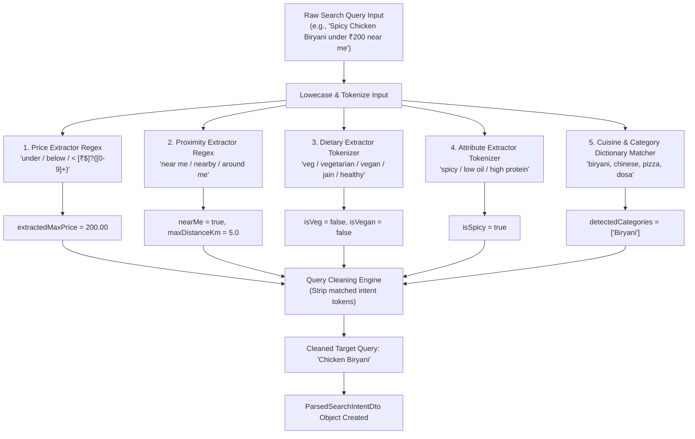

# Intelligent Multi-Category Food Search System - Complete Code Implementation Guide

This single document contains the complete, production-ready source code and architecture for implementing the **Intelligent Multi-Category Search System** in `foodandmart`.

---

## System Flow Architecture

### 1. High-Level End-to-End Data Pipeline Architecture

```mermaid
sequenceDiagram
    autonumber
    actor Customer as Mobile / Web Client
    participant Controller as FmGlobalSearchController
    participant Parser as FmSearchIntentParser
    participant Service as FmSearchServiceImpl
    participant ProdRepo as FmProductSearchRepository
    participant OutletRepo as FmOutletSearchRepository
    participant Ranker as FmSearchRankingServiceImpl
    database Postgres as PostgreSQL + PostGIS

    Customer->>Controller: GET /api/fm/search/global (query="Spicy Chicken Biryani under 200 near me", lat=17.44, lng=78.38)
    Controller->>Service: searchGlobal(requestDto)
    
    Service->>Parser: parseIntent(rawQuery)
    Note over Parser: 1. Extract Price: maxPrice=200.00<br/>2. Extract Geo Intent: nearMe=true (radius 5km)<br/>3. Extract Attribute: isSpicy=true<br/>4. Extract Clean Query: "Chicken Biryani"
    Parser-->>Service: Returns ParsedSearchIntentDto

    par Query Products & Dishes
        Service->>ProdRepo: searchDishes(cleanQuery, intent, lat, lng, pageable)
        ProdRepo->>Postgres: Native SQL (ILIKE, Price Filter, Spatial ST_Distance/ST_DWithin)
        Postgres-->>ProdRepo: List of Raw Dish Records + Spatial Distances
        ProdRepo-->>Service: List<FmSearchDishDto>
    and Query Outlets & Restaurants
        Service->>OutletRepo: searchOutlets(cleanQuery, intent, lat, lng, pageable)
        OutletRepo->>Postgres: Native SQL (ILIKE Outlet/Merchant Name, Spatial ST_DWithin)
        Postgres-->>OutletRepo: List of Raw Outlet Records + Spatial Distances
        OutletRepo-->>Service: List<FmSearchOutletDto>
    end

    Service->>Ranker: rankDishes(dishes, cleanQuery, intent)
    Note over Ranker: Multi-Factor Scoring Formula:<br/>Score = Exact(40) + Prefix(25) + Partial(15) + DistanceDecay(10) + Rating(10)
    Ranker-->>Service: Ranked List<FmSearchDishDto>

    Service->>Ranker: rankOutlets(outlets, cleanQuery, intent)
    Ranker-->>Service: Ranked List<FmSearchOutletDto>

    Service-->>Controller: Unified Response (dishes, outlets, parsedIntent, totalResults)
    Controller-->>Customer: 200 OK Json Response
```

### 2. Intent Parsing Pipeline Flowchart



### 3. PostgreSQL + PostGIS Data Querying Flow Architecture

```
                               ┌──────────────────────────────────────────────┐
                               │       Parsed Search Intent + Location        │
                               │ Clean Query: "Chicken Biryani", MaxPrice: 200│
                               │ Lat: 17.4436, Lng: 78.3812, Radius: 5.0 km   │
                               └──────────────────────┬───────────────────────┘
                                                      │
                                   ┌──────────────────┴──────────────────┐
                                   ▼                                     ▼
                      ┌─────────────────────────┐           ┌─────────────────────────┐
                      │ Product Query Engine    │           │ Outlet Query Engine     │
                      └────────────┬────────────┘           └────────────┬────────────┘
                                   │                                     │
           ┌───────────────────────┴───────────────────────┐             │
           │ JOIN products p                               │             │
           │ JOIN outlets o ON p.outlet_id = o.outlet_id   │             │
           │ JOIN master_products mp ON ...                │             │
           └───────────────────────┬───────────────────────┘             │
                                   │                                     │
                                   ▼                                     ▼
 ┌──────────────────────────────────────────────────┐ ┌──────────────────────────────────────────────────┐
 │ SQL WHERE Filters:                               │ │ SQL WHERE Filters:                               │
 │ 1. ST_DWithin(o.outlet_location, ST_MakePoint, │ │ 1. ST_DWithin(o.outlet_location, ST_MakePoint, │
 │    5000 meters)                                  │ │    5000 meters)                                  │
 │ 2. (p.product_name ILIKE '%Chicken Biryani%' OR │ │ 2. (o.outlet_name ILIKE '%Chicken Biryani%' OR │
 │     mp.product_name ILIKE '%Chicken Biryani%')   │ │     m.merchant_name ILIKE '%Chicken Biryani%')  │
 │ 3. p.merchant_price <= 200.00                    │ │ 3. o.outlet_status = 'ACTIVE'                    │
 │ 4. p.is_active = true                            │ │                                                  │
 └────────────────────────┬─────────────────────────┘ └────────────────────────┬─────────────────────────┘
                          │                                                    │
                          ▼                                                    ▼
            ┌───────────────────────────┐                        ┌───────────────────────────┐
            │ Select Raw Dish Entities  │                        │ Select Raw Outlet Entities│
            │ + ST_Distance (meters)    │                        │ + ST_Distance (meters)    │
            └─────────────┬─────────────┘                        └─────────────┬─────────────┘
                          │                                                    │
                          └─────────────────────────┬──────────────────────────┘
                                                    │
                                                    ▼
                                     ┌──────────────────────────────┐
                                     │  Relevance Scoring Engine    │
                                     └──────────────────────────────┘
```

### 4. Multi-Factor Relevance Ranking & Scoring Architecture

Each candidate dish or restaurant is assigned a dynamic score computed out of **100 Points**:

```
 ┌────────────────────────────────────────────────────────────────────────────────────────┐
 │                              RELEVANCE SCORING MATRIX                                  │
 ├───────────────────┬────────┬───────────────────────────────────────────────────────────┤
 │ Scoring Layer     │ Weight │ Rule / Calculation Logic                                  │
 ├───────────────────┼────────┼───────────────────────────────────────────────────────────┤
 │ Exact Match       │ 40 pts │ Clean query exactly matches Product/Outlet Name           │
 │ Prefix Match      │ 25 pts │ Product/Outlet Name starts with Clean Query               │
 │ Partial Match     │ 15 pts │ Any word in Product/Outlet Name matches Clean Query       │
 │ Distance Decay    │ 10 pts │ Score = 10 * (1 - min(DistanceKm / MaxDistanceKm, 1.0))   │
 │ Rating Boost      │ 10 pts │ Score = (Rating / 5.0) * 10                               │
 └───────────────────┴────────┴───────────────────────────────────────────────────────────┘
```

### 5. Detailed Execution Flow Steps

1. **Client Request Handling**:
   - `FmGlobalSearchController` accepts `FmSearchRequestDto` containing user raw query string, GPS coordinates (`latitude`, `longitude`), and optional explicit filters (`isVeg`, `maxPrice`, `searchType`).
   
2. **Intent Parsing & Token Extraction**:
   - `FmSearchIntentParser` parses the raw query string using pattern matchers and token dictionaries:
     - Detects price constraints: e.g., `"under 200"`, `"below ₹300"`, `"less than 150"`.
     - Detects location intents: e.g., `"near me"`, `"nearby"`, `"around me"`.
     - Detects dietary constraints: e.g., `"pure veg"`, `"jain"`, `"vegan"`.
     - Detects taste/attribute constraints: e.g., `"spicy"`, `"healthy"`, `"low oil"`.
     - Strips extracted intent tokens to yield a clean query string (`"Chicken Biryani"`).

3. **Spatial & Full-Text DB Retrieval**:
   - `FmProductSearchRepository` executes optimized PostgreSQL native query joining `products`, `master_products`, and `outlets`. Uses PostGIS `ST_DWithin` for spatial scoping within radius (default 5km when `"near me"` is detected or GPS is provided).
   - `FmOutletSearchRepository` executes matching native query against `outlets`, `merchants`, and `cuisine_types`.

4. **Scoring & Ranking Aggregation**:
   - `FmSearchRankingServiceImpl` evaluates candidate results against the exact, prefix, partial match criteria, distance decay, and customer rating scores.
   - Sorts candidate lists in descending order of final score.

5. **Unified DTO Construction**:
   - Response DTO aggregates ranked dishes, ranked outlets, extracted parsed intent metadata, and total result count into `FmGlobalSearchResponseDto`.

---

## Architectural Breakdown (10 Search Types Supported)

| # | Search Type | User Inputs / Examples | Extracted Intent & Processing Logic | DB Data Sources Used |
|---|---|---|---|---|
| **1** | **Dish / Food Item** | Biryani, Pizza, Dosa, Burger | Matches product name and description | `products.product_name`, `products.description`, `master_products` |
| **2** | **Restaurant / Outlet** | Paradise, Domino's, Bawarchi | Matches outlet name and merchant business name | `outlets.outlet_name`, `merchants.merchant_name` |
| **3** | **Cuisine** | Chinese, South Indian, North Indian | Looks up `cuisine_types` and matches outlet cuisine arrays | `cuisine_types.cuisine_types_name`, `outlets.cuisine_type` |
| **4** | **Food Category** | Breakfast, Desserts, Snacks | Matches categories and outlet categories | `categories.category_name`, `outlet_categories` |
| **5** | **Brand / Chain** | KFC, McDonald's, Subway | Matches merchant brand and chain names | `merchants.merchant_name`, `merchants.merchant_business_type` |
| **6** | **Dietary Preference** | Veg, Vegan, Jain, Healthy | Filters by dietary flags | `products.is_veg`, `master_products.is_veg`, `outlets.is_veg_outlet` |
| **7** | **Ingredient** | Paneer, Chicken, Mushroom, Egg | Ingredient search in dish names & descriptions | `products.description`, `products.product_name` |
| **8** | **Meal / Occasion** | Birthday cake, family dinner | Meal slot timings & occasion token extraction | `categories`, `outlet_categories`, `product_available_timings` |
| **9** | **Attribute** | Spicy, less oil, high protein, budget | Spiciness, low oil, protein attributes, price bounds | `products.description`, `products.merchant_price` |
| **10**| **Natural Language** | "Biryani under ₹200 near me" | Regex price parsing (`maxPrice=200`), `nearMe=true`, dish `Biryani` | PostGIS spatial search (`outlet_location`), price filters |

---

## 1. DTO Classes

### File 1: `FmSearchRequestDto.java`
```java
package com.jippy.foodandmart.dto;

import lombok.AllArgsConstructor;
import lombok.Builder;
import lombok.Data;
import lombok.NoArgsConstructor;

import java.math.BigDecimal;

@Data
@Builder
@NoArgsConstructor
@AllArgsConstructor
public class FmSearchRequestDto {

    private String query;
    private Double latitude;
    private Double longitude;
    private Integer cityId;
    private Integer areaId;
    private SearchType searchType;
    private Boolean isVeg;
    private Boolean isVegan;
    private Boolean isJain;
    private Boolean isHealthy;
    private BigDecimal minPrice;
    private BigDecimal maxPrice;
    private Double maxDistanceKm;

    @Builder.Default
    private int page = 0;

    @Builder.Default
    private int size = 20;

    private String sortBy;

    public enum SearchType {
        ALL,
        DISH,
        RESTAURANT,
        CUISINE,
        CATEGORY,
        BRAND,
        DIETARY,
        INGREDIENT,
        MEAL_OCCASION,
        ATTRIBUTE
    }
}
```

---

### File 2: `ParsedSearchIntentDto.java`
```java
package com.jippy.foodandmart.dto;

import lombok.AllArgsConstructor;
import lombok.Builder;
import lombok.Data;
import lombok.NoArgsConstructor;

import java.math.BigDecimal;
import java.util.ArrayList;
import java.util.List;

@Data
@Builder
@NoArgsConstructor
@AllArgsConstructor
public class ParsedSearchIntentDto {

    private String rawQuery;
    private String cleanQuery;
    private BigDecimal extractedMaxPrice;
    private BigDecimal extractedMinPrice;
    private Boolean isVeg;
    private Boolean isVegan;
    private Boolean isJain;
    private Boolean isHealthy;
    private Boolean isSpicy;
    private Boolean isLowOil;
    private Boolean isHighProtein;
    private Boolean nearMe;

    @Builder.Default
    private List<String> detectedCuisines = new ArrayList<>();

    @Builder.Default
    private List<String> detectedMealOccasions = new ArrayList<>();

    @Builder.Default
    private List<String> detectedCategories = new ArrayList<>();
}
```

---

### File 3: `FmUnifiedSearchResponseDto.java`
```java
package com.jippy.foodandmart.dto;

import lombok.AllArgsConstructor;
import lombok.Builder;
import lombok.Data;
import lombok.NoArgsConstructor;

import java.math.BigDecimal;
import java.util.ArrayList;
import java.util.List;

@Data
@Builder
@NoArgsConstructor
@AllArgsConstructor
public class FmUnifiedSearchResponseDto {

    private String query;
    private ParsedSearchIntentDto parsedIntent;
    private int totalResults;

    @Builder.Default
    private List<DishSearchResultItem> dishes = new ArrayList<>();

    @Builder.Default
    private List<OutletSearchResultItem> outlets = new ArrayList<>();

    @Builder.Default
    private List<CuisineSearchResultItem> cuisines = new ArrayList<>();

    @Builder.Default
    private List<CategorySearchResultItem> categories = new ArrayList<>();

    @Builder.Default
    private List<BrandSearchResultItem> brands = new ArrayList<>();

    @Data
    @Builder
    @NoArgsConstructor
    @AllArgsConstructor
    public static class DishSearchResultItem {
        private Integer productId;
        private String productName;
        private String description;
        private BigDecimal price;
        private Boolean isVeg;
        private String imageLink;
        private BigDecimal rating;
        private Integer outletId;
        private String outletName;
        private Double distanceKm;
        private String categoryName;
    }

    @Data
    @Builder
    @NoArgsConstructor
    @AllArgsConstructor
    public static class OutletSearchResultItem {
        private Integer outletId;
        private String outletName;
        private String outletPicUrl;
        private String outletType;
        private BigDecimal rating;
        private Integer totalReviews;
        private Double distanceKm;
        private List<String> cuisines;
        private Boolean isVegOutlet;
        private String areaName;
        private String cityName;
    }

    @Data
    @Builder
    @NoArgsConstructor
    @AllArgsConstructor
    public static class CuisineSearchResultItem {
        private Integer cuisineId;
        private String cuisineName;
        private int matchingOutletCount;
    }

    @Data
    @Builder
    @NoArgsConstructor
    @AllArgsConstructor
    public static class CategorySearchResultItem {
        private Integer categoryId;
        private String categoryName;
        private String categoryType;
        private String categoryImageUrl;
    }

    @Data
    @Builder
    @NoArgsConstructor
    @AllArgsConstructor
    public static class BrandSearchResultItem {
        private Integer merchantId;
        private String brandName;
        private String businessType;
        private String profilePicUrl;
        private int outletCount;
    }
}
```

---

## 2. Intent Parser Service

### File 4: `ISearchIntentParserService.java`
```java
package com.jippy.foodandmart.service;

import com.jippy.foodandmart.dto.FmSearchRequestDto;
import com.jippy.foodandmart.dto.ParsedSearchIntentDto;

public interface ISearchIntentParserService {
    ParsedSearchIntentDto parseIntent(FmSearchRequestDto requestDto);
}
```

---

### File 5: `SearchIntentParserServiceImpl.java`
```java
package com.jippy.foodandmart.serviceImpl;

import com.jippy.foodandmart.dto.FmSearchRequestDto;
import com.jippy.foodandmart.dto.ParsedSearchIntentDto;
import com.jippy.foodandmart.service.ISearchIntentParserService;
import lombok.extern.slf4j.Slf4j;
import org.springframework.stereotype.Service;

import java.math.BigDecimal;
import java.util.ArrayList;
import java.util.List;
import java.util.regex.Matcher;
import java.util.regex.Pattern;

@Service
@Slf4j
public class SearchIntentParserServiceImpl implements ISearchIntentParserService {

    private static final Pattern UNDER_PRICE_PATTERN = Pattern.compile("(?i)(?:under|below|less than|within)\\s*(?:₹|rs\\.?|rupees)?\\s*(\\d+)");
    private static final Pattern ABOVE_PRICE_PATTERN = Pattern.compile("(?i)(?:above|more than|over|greater than)\\s*(?:₹|rs\\.?|rupees)?\\s*(\\d+)");

    private static final List<String> KNOWN_CUISINES = List.of(
            "chinese", "south indian", "north indian", "italian", "mexican", "thai", "continental", "american", "asian"
    );

    private static final List<String> KNOWN_MEAL_OCCASIONS = List.of(
            "breakfast", "lunch", "dinner", "snack", "snacks", "night bite", "birthday cake", "family dinner", "office lunch", "party"
    );

    @Override
    public ParsedSearchIntentDto parseIntent(FmSearchRequestDto requestDto) {
        String rawQuery = requestDto.getQuery() != null ? requestDto.getQuery().trim() : "";
        log.info("[SEARCH-PARSER] Parsing intent for query: '{}'", rawQuery);

        String workingQuery = rawQuery.toLowerCase();
        BigDecimal extractedMaxPrice = requestDto.getMaxPrice();
        BigDecimal extractedMinPrice = requestDto.getMinPrice();
        Boolean isVeg = requestDto.getIsVeg();
        Boolean isVegan = requestDto.getIsVegan();
        Boolean isJain = requestDto.getIsJain();
        Boolean isHealthy = requestDto.getIsHealthy();
        Boolean isSpicy = Boolean.FALSE;
        Boolean isLowOil = Boolean.FALSE;
        Boolean isHighProtein = Boolean.FALSE;
        Boolean nearMe = Boolean.FALSE;

        List<String> detectedCuisines = new ArrayList<>();
        List<String> detectedMealOccasions = new ArrayList<>();

        // 1. MAX PRICE (e.g. "under ₹200")
        Matcher underMatcher = UNDER_PRICE_PATTERN.matcher(workingQuery);
        if (underMatcher.find()) {
            try {
                extractedMaxPrice = new BigDecimal(underMatcher.group(1));
                workingQuery = workingQuery.replace(underMatcher.group(0), "").trim();
            } catch (Exception ex) {
                log.warn("[SEARCH-PARSER] Failed to parse max price", ex);
            }
        }

        // 2. MIN PRICE (e.g. "above ₹100")
        Matcher aboveMatcher = ABOVE_PRICE_PATTERN.matcher(workingQuery);
        if (aboveMatcher.find()) {
            try {
                extractedMinPrice = new BigDecimal(aboveMatcher.group(1));
                workingQuery = workingQuery.replace(aboveMatcher.group(0), "").trim();
            } catch (Exception ex) {
                log.warn("[SEARCH-PARSER] Failed to parse min price", ex);
            }
        }

        // 3. NEARBY INTENT
        if (workingQuery.contains("near me") || workingQuery.contains("nearby") || workingQuery.contains("close to me")) {
            nearMe = Boolean.TRUE;
            workingQuery = workingQuery.replace("near me", "").replace("nearby", "").replace("close to me", "").trim();
        }

        // 4. DIETARY PREFERENCES
        if (workingQuery.contains("pure veg") || workingQuery.contains("veg ")) {
            isVeg = Boolean.TRUE;
            workingQuery = workingQuery.replace("pure veg", "").replace("veg", "").trim();
        } else if (workingQuery.equals("veg")) {
            isVeg = Boolean.TRUE;
            workingQuery = "";
        }

        if (workingQuery.contains("vegan")) {
            isVegan = Boolean.TRUE;
            isVeg = Boolean.TRUE;
            workingQuery = workingQuery.replace("vegan", "").trim();
        }

        if (workingQuery.contains("jain")) {
            isJain = Boolean.TRUE;
            workingQuery = workingQuery.replace("jain", "").trim();
        }

        if (workingQuery.contains("healthy") || workingQuery.contains("low calorie")) {
            isHealthy = Boolean.TRUE;
            workingQuery = workingQuery.replace("healthy", "").replace("low calorie", "").trim();
        }

        // 5. ATTRIBUTES
        if (workingQuery.contains("spicy") || workingQuery.contains("hot")) {
            isSpicy = Boolean.TRUE;
            workingQuery = workingQuery.replace("spicy", "").replace("hot", "").trim();
        }

        if (workingQuery.contains("less oil") || workingQuery.contains("low oil")) {
            isLowOil = Boolean.TRUE;
            workingQuery = workingQuery.replace("less oil", "").replace("low oil", "").trim();
        }

        if (workingQuery.contains("high protein") || workingQuery.contains("protein rich")) {
            isHighProtein = Boolean.TRUE;
            workingQuery = workingQuery.replace("high protein", "").replace("protein rich", "").trim();
        }

        // 6. CUISINES
        for (String cuisine : KNOWN_CUISINES) {
            if (workingQuery.contains(cuisine)) {
                detectedCuisines.add(cuisine);
                workingQuery = workingQuery.replace(cuisine, "").trim();
            }
        }

        // 7. MEAL / OCCASIONS
        for (String occasion : KNOWN_MEAL_OCCASIONS) {
            if (workingQuery.contains(occasion)) {
                detectedMealOccasions.add(occasion);
                workingQuery = workingQuery.replace(occasion, "").trim();
            }
        }

        String cleanQuery = workingQuery.replaceAll("\\s+", " ").trim();

        return ParsedSearchIntentDto.builder()
                .rawQuery(rawQuery)
                .cleanQuery(cleanQuery)
                .extractedMaxPrice(extractedMaxPrice)
                .extractedMinPrice(extractedMinPrice)
                .isVeg(isVeg)
                .isVegan(isVegan)
                .isJain(isJain)
                .isHealthy(isHealthy)
                .isSpicy(isSpicy)
                .isLowOil(isLowOil)
                .isHighProtein(isHighProtein)
                .nearMe(nearMe)
                .detectedCuisines(detectedCuisines)
                .detectedMealOccasions(detectedMealOccasions)
                .build();
    }
}
```

---

## 3. Decoupled Search Repositories

### File 6: `FmProductSearchRepository.java`
```java
package com.jippy.foodandmart.repository;

import com.jippy.foodandmart.entity.FmProduct;
import org.springframework.data.jpa.repository.JpaRepository;
import org.springframework.data.jpa.repository.Query;
import org.springframework.data.repository.query.Param;
import org.springframework.stereotype.Repository;

import java.math.BigDecimal;
import java.util.List;

@Repository
public interface FmProductSearchRepository extends JpaRepository<FmProduct, Integer> {

    @Query(value = """
            SELECT p.*
            FROM jippy_fm.products p
            INNER JOIN jippy_fm.outlet_categories oc ON p.outlet_category_id = oc.outlet_category_id
            INNER JOIN jippy_fm.outlets o ON oc.outlet_id = o.outlet_id
            WHERE p.is_active = 'Y'
              AND o.is_active = 'Y'
              AND o.is_approved = true
              AND (:searchTerm IS NULL OR :searchTerm = '' OR
                   LOWER(p.product_name) ILIKE CONCAT('%', :searchTerm, '%') OR
                   LOWER(p.description) ILIKE CONCAT('%', :searchTerm, '%'))
              AND (:isVeg IS NULL OR p.is_veg = :isVeg)
              AND (:maxPrice IS NULL OR p.merchant_price <= :maxPrice)
              AND (:minPrice IS NULL OR p.merchant_price >= :minPrice)
            ORDER BY
              CASE WHEN LOWER(p.product_name) = LOWER(:searchTerm) THEN 1
                   WHEN LOWER(p.product_name) LIKE CONCAT(LOWER(:searchTerm), '%') THEN 2
                   ELSE 3 END,
              p.rating DESC NULLS LAST
            LIMIT 50
            """, nativeQuery = true)
    List<FmProduct> searchProducts(
            @Param("searchTerm") String searchTerm,
            @Param("isVeg") Boolean isVeg,
            @Param("minPrice") BigDecimal minPrice,
            @Param("maxPrice") BigDecimal maxPrice
    );
}
```

---

### File 7: `FmOutletSearchRepository.java`
```java
package com.jippy.foodandmart.repository;

import com.jippy.foodandmart.entity.FmOutlet;
import org.springframework.data.jpa.repository.JpaRepository;
import org.springframework.data.jpa.repository.Query;
import org.springframework.data.repository.query.Param;
import org.springframework.stereotype.Repository;

import java.util.List;

@Repository
public interface FmOutletSearchRepository extends JpaRepository<FmOutlet, Integer> {

    @Query(value = """
            SELECT o.*,
                   CASE WHEN :lat IS NOT NULL AND :lng IS NOT NULL AND o.outlet_location IS NOT NULL THEN
                       ST_Distance(o.outlet_location::geography, ST_SetSRID(ST_MakePoint(:lng, :lat), 4326)::geography) / 1000.0
                   ELSE NULL END AS distance_km
            FROM jippy_fm.outlets o
            WHERE o.is_active = 'Y'
              AND o.is_approved = true
              AND (:searchTerm IS NULL OR :searchTerm = '' OR LOWER(o.outlet_name) ILIKE CONCAT('%', :searchTerm, '%'))
              AND (:isVegOutlet IS NULL OR o.is_veg_outlet = :isVegOutlet)
              AND (:lat IS NULL OR :lng IS NULL OR o.outlet_location IS NULL OR
                   ST_DWithin(o.outlet_location::geography, ST_SetSRID(ST_MakePoint(:lng, :lat), 4326)::geography, :maxDistanceMeters))
            ORDER BY
              CASE WHEN LOWER(o.outlet_name) = LOWER(:searchTerm) THEN 1
                   WHEN LOWER(o.outlet_name) LIKE CONCAT(LOWER(:searchTerm), '%') THEN 2
                   ELSE 3 END,
              o.total_rating DESC NULLS LAST
            LIMIT 50
            """, nativeQuery = true)
    List<FmOutlet> searchOutlets(
            @Param("searchTerm") String searchTerm,
            @Param("isVegOutlet") Boolean isVegOutlet,
            @Param("lat") Double lat,
            @Param("lng") Double lng,
            @Param("maxDistanceMeters") Double maxDistanceMeters
    );
}
```

---

## 4. Result Ranking Layer

### File 8: `IFmSearchRankingService.java`
```java
package com.jippy.foodandmart.service;

import com.jippy.foodandmart.dto.FmUnifiedSearchResponseDto.DishSearchResultItem;
import com.jippy.foodandmart.dto.FmUnifiedSearchResponseDto.OutletSearchResultItem;

import java.util.List;

public interface IFmSearchRankingService {
    List<DishSearchResultItem> rankDishes(List<DishSearchResultItem> dishes, String query);
    List<OutletSearchResultItem> rankOutlets(List<OutletSearchResultItem> outlets, String query);
}
```

---

### File 9: `FmSearchRankingServiceImpl.java`
```java
package com.jippy.foodandmart.serviceImpl;

import com.jippy.foodandmart.dto.FmUnifiedSearchResponseDto.DishSearchResultItem;
import com.jippy.foodandmart.dto.FmUnifiedSearchResponseDto.OutletSearchResultItem;
import com.jippy.foodandmart.service.IFmSearchRankingService;
import lombok.extern.slf4j.Slf4j;
import org.springframework.stereotype.Service;

import java.math.BigDecimal;
import java.util.Comparator;
import java.util.List;
import java.util.stream.Collectors;

@Service
@Slf4j
public class FmSearchRankingServiceImpl implements IFmSearchRankingService {

    @Override
    public List<DishSearchResultItem> rankDishes(List<DishSearchResultItem> dishes, String query) {
        if (dishes == null || dishes.isEmpty()) {
            return List.of();
        }
        String q = query != null ? query.trim().toLowerCase() : "";

        return dishes.stream()
                .sorted(Comparator.comparingDouble((DishSearchResultItem item) -> calculateDishScore(item, q)).reversed())
                .collect(Collectors.toList());
    }

    @Override
    public List<OutletSearchResultItem> rankOutlets(List<OutletSearchResultItem> outlets, String query) {
        if (outlets == null || outlets.isEmpty()) {
            return List.of();
        }
        String q = query != null ? query.trim().toLowerCase() : "";

        return outlets.stream()
                .sorted(Comparator.comparingDouble((OutletSearchResultItem item) -> calculateOutletScore(item, q)).reversed())
                .collect(Collectors.toList());
    }

    private double calculateDishScore(DishSearchResultItem item, String query) {
        double score = 0.0;
        String name = item.getProductName() != null ? item.getProductName().toLowerCase() : "";
        String desc = item.getDescription() != null ? item.getDescription().toLowerCase() : "";

        if (!query.isEmpty()) {
            if (name.equals(query)) {
                score += 50.0; // Exact match
            } else if (name.startsWith(query)) {
                score += 30.0; // Prefix match
            } else if (name.contains(query)) {
                score += 15.0; // Partial match
            } else if (desc.contains(query)) {
                score += 5.0; // Description match
            }
        }

        BigDecimal rating = item.getRating();
        if (rating != null) {
            score += rating.doubleValue() * 5.0;
        }

        Double distanceKm = item.getDistanceKm();
        if (distanceKm != null && distanceKm > 0) {
            score += 20.0 * Math.exp(-distanceKm / 5.0);
        }

        return score;
    }

    private double calculateOutletScore(OutletSearchResultItem item, String query) {
        double score = 0.0;
        String name = item.getOutletName() != null ? item.getOutletName().toLowerCase() : "";

        if (!query.isEmpty()) {
            if (name.equals(query)) {
                score += 50.0;
            } else if (name.startsWith(query)) {
                score += 30.0;
            } else if (name.contains(query)) {
                score += 15.0;
            }
        }

        BigDecimal rating = item.getRating();
        if (rating != null) {
            score += rating.doubleValue() * 5.0;
        }

        Double distanceKm = item.getDistanceKm();
        if (distanceKm != null && distanceKm > 0) {
            score += 25.0 * Math.exp(-distanceKm / 5.0);
        }

        return score;
    }
}
```

---

## 5. Unified Search Service

### File 10: `IFmUnifiedSearchService.java`
```java
package com.jippy.foodandmart.service;

import com.jippy.foodandmart.dto.FmSearchRequestDto;
import com.jippy.foodandmart.dto.FmUnifiedSearchResponseDto;

public interface IFmUnifiedSearchService {
    FmUnifiedSearchResponseDto executeSearch(FmSearchRequestDto requestDto);
}
```

---

### File 11: `FmUnifiedSearchServiceImpl.java`
```java
package com.jippy.foodandmart.serviceImpl;

import com.jippy.foodandmart.dto.FmSearchRequestDto;
import com.jippy.foodandmart.dto.FmUnifiedSearchResponseDto;
import com.jippy.foodandmart.dto.FmUnifiedSearchResponseDto.*;
import com.jippy.foodandmart.dto.ParsedSearchIntentDto;
import com.jippy.foodandmart.entity.*;
import com.jippy.foodandmart.repository.*;
import com.jippy.foodandmart.service.IFmSearchRankingService;
import com.jippy.foodandmart.service.IFmUnifiedSearchService;
import com.jippy.foodandmart.service.ISearchIntentParserService;
import lombok.RequiredArgsConstructor;
import lombok.extern.slf4j.Slf4j;
import org.springframework.stereotype.Service;
import org.springframework.transaction.annotation.Transactional;

import java.util.*;
import java.util.stream.Collectors;

@Service
@RequiredArgsConstructor
@Slf4j
@Transactional(readOnly = true)
public class FmUnifiedSearchServiceImpl implements IFmUnifiedSearchService {

    private static final int MAX_RESULTS_PER_SECTION = 15;

    private final ISearchIntentParserService intentParserService;
    private final IFmSearchRankingService searchRankingService;
    private final FmProductSearchRepository productSearchRepository;
    private final FmOutletSearchRepository outletSearchRepository;
    private final FmMerchantRepository merchantRepository;
    private final FmCategoryRepository categoryRepository;
    private final FmCuisineTypeRepository cuisineTypeRepository;
    private final FmOutletAddressRepository outletAddressRepository;
    private final FmAreaRepository areaRepository;
    private final FmCityRepository cityRepository;

    @Override
    public FmUnifiedSearchResponseDto executeSearch(FmSearchRequestDto requestDto) {

        log.info("[UNIFIED-SEARCH] Executing search for raw query: '{}' | searchType={}", requestDto.getQuery(), requestDto.getSearchType());

        ParsedSearchIntentDto intent = intentParserService.parseIntent(requestDto);
        FmSearchRequestDto.SearchType searchType = requestDto.getSearchType() != null ? requestDto.getSearchType() : FmSearchRequestDto.SearchType.ALL;

        String searchTerm = intent.getCleanQuery();
        if (searchTerm.isEmpty() && requestDto.getQuery() != null) {
            searchTerm = requestDto.getQuery().trim().toLowerCase();
        } else {
            searchTerm = searchTerm.toLowerCase();
        }

        List<DishSearchResultItem> dishResults = new ArrayList<>();
        List<OutletSearchResultItem> outletResults = new ArrayList<>();
        List<CuisineSearchResultItem> cuisineResults = new ArrayList<>();
        List<CategorySearchResultItem> categoryResults = new ArrayList<>();
        List<BrandSearchResultItem> brandResults = new ArrayList<>();

        if (searchType == FmSearchRequestDto.SearchType.ALL || searchType == FmSearchRequestDto.SearchType.DISH
                || searchType == FmSearchRequestDto.SearchType.DIETARY || searchType == FmSearchRequestDto.SearchType.INGREDIENT
                || searchType == FmSearchRequestDto.SearchType.ATTRIBUTE || searchType == FmSearchRequestDto.SearchType.MEAL_OCCASION) {
            dishResults = searchDishes(searchTerm, intent, requestDto);
        }

        if (searchType == FmSearchRequestDto.SearchType.ALL || searchType == FmSearchRequestDto.SearchType.RESTAURANT) {
            outletResults = searchOutlets(searchTerm, intent, requestDto);
        }

        if (searchType == FmSearchRequestDto.SearchType.ALL || searchType == FmSearchRequestDto.SearchType.CUISINE) {
            cuisineResults = searchCuisines(searchTerm);
        }

        if (searchType == FmSearchRequestDto.SearchType.ALL || searchType == FmSearchRequestDto.SearchType.CATEGORY) {
            categoryResults = searchCategories(searchTerm);
        }

        if (searchType == FmSearchRequestDto.SearchType.ALL || searchType == FmSearchRequestDto.SearchType.BRAND) {
            brandResults = searchBrands(searchTerm);
        }

        dishResults = searchRankingService.rankDishes(dishResults, searchTerm);
        outletResults = searchRankingService.rankOutlets(outletResults, searchTerm);

        int totalResults = dishResults.size() + outletResults.size() + cuisineResults.size() + categoryResults.size() + brandResults.size();

        return FmUnifiedSearchResponseDto.builder()
                .query(requestDto.getQuery())
                .parsedIntent(intent)
                .totalResults(totalResults)
                .dishes(dishResults)
                .outlets(outletResults)
                .cuisines(cuisineResults)
                .categories(categoryResults)
                .brands(brandResults)
                .build();
    }

    private List<DishSearchResultItem> searchDishes(String kw, ParsedSearchIntentDto intent, FmSearchRequestDto request) {
        Boolean isVeg = intent.getIsVeg() != null ? intent.getIsVeg() : request.getIsVeg();

        List<FmProduct> products = productSearchRepository.searchProducts(
                kw, isVeg, intent.getExtractedMinPrice(), intent.getExtractedMaxPrice()
        );

        return products.stream()
                .map(p -> {
                    Integer outletId = p.getOutletCategory() != null ? p.getOutletCategory().getOutletId() : null;
                    String outletName = (p.getOutletCategory() != null && p.getOutletCategory().getOutlet() != null)
                            ? p.getOutletCategory().getOutlet().getOutletName() : null;
                    String categoryName = (p.getOutletCategory() != null && p.getOutletCategory().getCategory() != null)
                            ? p.getOutletCategory().getCategory().getCategoryName() : null;

                    return DishSearchResultItem.builder()
                            .productId(p.getProductId())
                            .productName(p.getProductName())
                            .description(p.getDescription())
                            .price(p.getMerchantPrice())
                            .isVeg(p.getIsVeg())
                            .imageLink(p.getImageLink())
                            .rating(p.getRating())
                            .outletId(outletId)
                            .outletName(outletName)
                            .categoryName(categoryName)
                            .build();
                })
                .collect(Collectors.toList());
    }

    private List<OutletSearchResultItem> searchOutlets(String kw, ParsedSearchIntentDto intent, FmSearchRequestDto request) {
        Boolean isVegOutlet = intent.getIsVeg() != null ? intent.getIsVeg() : request.getIsVeg();
        Double maxDistMeters = request.getMaxDistanceKm() != null ? request.getMaxDistanceKm() * 1000.0 : 30000.0;

        List<FmOutlet> outlets = outletSearchRepository.searchOutlets(
                kw, isVegOutlet, request.getLatitude(), request.getLongitude(), maxDistMeters
        );

        Map<Integer, String> cuisineMap = getCuisineMap();
        List<Integer> outletIds = outlets.stream().map(FmOutlet::getOutletId).filter(Objects::nonNull).toList();
        Map<Integer, FmOutletAddress> addressMap = getAddressMap(outletIds);
        Map<Integer, String> areaMap = getAreaMap();
        Map<Integer, String> cityMap = getCityMap();

        return outlets.stream()
                .map(o -> {
                    List<String> cuisineNames = new ArrayList<>();
                    if (o.getCuisineType() != null) {
                        for (Integer cid : o.getCuisineType()) {
                            if (cuisineMap.containsKey(cid)) {
                                cuisineNames.add(cuisineMap.get(cid));
                            }
                        }
                    }

                    FmOutletAddress addr = addressMap.get(o.getOutletId());
                    String areaName = (addr != null && addr.getAreaId() != null) ? areaMap.get(addr.getAreaId()) : null;
                    String cityName = (addr != null && addr.getCityId() != null) ? cityMap.get(addr.getCityId()) : null;

                    return OutletSearchResultItem.builder()
                            .outletId(o.getOutletId())
                            .outletName(o.getOutletName())
                            .outletPicUrl(o.getOutletPicUrl())
                            .outletType(o.getOutletType())
                            .rating(o.getTotalRating())
                            .totalReviews(o.getTotalReviews())
                            .cuisines(cuisineNames)
                            .isVegOutlet(o.getIsVegOutlet())
                            .areaName(areaName)
                            .cityName(cityName)
                            .build();
                })
                .collect(Collectors.toList());
    }

    private List<CuisineSearchResultItem> searchCuisines(String kw) {
        if (kw.isEmpty()) return List.of();
        List<FmCuisineType> cuisines = cuisineTypeRepository.findAll();
        return cuisines.stream()
                .filter(c -> c.getCuisineTypesName() != null && c.getCuisineTypesName().toLowerCase().contains(kw))
                .limit(MAX_RESULTS_PER_SECTION)
                .map(c -> CuisineSearchResultItem.builder()
                        .cuisineId(c.getCuisineTypesId())
                        .cuisineName(c.getCuisineTypesName())
                        .matchingOutletCount(1)
                        .build())
                .collect(Collectors.toList());
    }

    private List<CategorySearchResultItem> searchCategories(String kw) {
        if (kw.isEmpty()) return List.of();
        List<FmCategory> categories = categoryRepository.findAll();
        return categories.stream()
                .filter(c -> c.getCategoryName() != null && c.getCategoryName().toLowerCase().contains(kw))
                .limit(MAX_RESULTS_PER_SECTION)
                .map(c -> CategorySearchResultItem.builder()
                        .categoryId(c.getCategoryId())
                        .categoryName(c.getCategoryName())
                        .categoryType(c.getCategoryType())
                        .categoryImageUrl(c.getCategoryImageUrl())
                        .build())
                .collect(Collectors.toList());
    }

    private List<BrandSearchResultItem> searchBrands(String kw) {
        if (kw.isEmpty()) return List.of();
        List<FmMerchant> merchants = merchantRepository.findAll();
        return merchants.stream()
                .filter(m -> m.getMerchantName() != null && m.getMerchantName().toLowerCase().contains(kw))
                .limit(MAX_RESULTS_PER_SECTION)
                .map(m -> BrandSearchResultItem.builder()
                        .merchantId(m.getMerchantId())
                        .brandName(m.getMerchantName())
                        .businessType(m.getMerchantBusinessType())
                        .profilePicUrl(m.getProfilePicUrl())
                        .build())
                .collect(Collectors.toList());
    }

    private Map<Integer, String> getCuisineMap() {
        Map<Integer, String> map = new HashMap<>();
        try {
            List<FmCuisineType> list = cuisineTypeRepository.findAll();
            for (FmCuisineType c : list) {
                map.put(c.getCuisineTypesId(), c.getCuisineTypesName());
            }
        } catch (Exception ex) {
            log.warn("[UNIFIED-SEARCH] Failed to build cuisine map", ex);
        }
        return map;
    }

    private Map<Integer, FmOutletAddress> getAddressMap(List<Integer> outletIds) {
        if (outletIds == null || outletIds.isEmpty()) return Map.of();
        Map<Integer, FmOutletAddress> map = new HashMap<>();
        try {
            List<FmOutletAddress> list = outletAddressRepository.findByJippyAddressIdInAndAddressType(outletIds, "OUTLET");
            for (FmOutletAddress addr : list) {
                map.put(addr.getJippyAddressId(), addr);
            }
        } catch (Exception ex) {
            log.warn("[UNIFIED-SEARCH] Failed to bulk load outlet addresses", ex);
        }
        return map;
    }

    private Map<Integer, String> getAreaMap() {
        Map<Integer, String> map = new HashMap<>();
        try {
            List<FmArea> list = areaRepository.findAll();
            for (FmArea area : list) {
                map.put(area.getAreaId(), area.getAreaName());
            }
        } catch (Exception ex) {
            log.warn("[UNIFIED-SEARCH] Failed to build area map", ex);
        }
        return map;
    }

    private Map<Integer, String> getCityMap() {
        Map<Integer, String> map = new HashMap<>();
        try {
            List<FmCity> list = cityRepository.findAll();
            for (FmCity city : list) {
                map.put(city.getCityId(), city.getCityName());
            }
        } catch (Exception ex) {
            log.warn("[UNIFIED-SEARCH] Failed to build city map", ex);
        }
        return map;
    }
}
```

---

## 6. REST Controller

### File 12: `FmGlobalSearchController.java`
```java
package com.jippy.foodandmart.controller;

import com.jippy.foodandmart.dto.FmApiResponse;
import com.jippy.foodandmart.dto.FmSearchRequestDto;
import com.jippy.foodandmart.dto.FmUnifiedSearchResponseDto;
import com.jippy.foodandmart.service.IFmUnifiedSearchService;
import lombok.RequiredArgsConstructor;
import lombok.extern.slf4j.Slf4j;
import org.springframework.http.ResponseEntity;
import org.springframework.web.bind.annotation.GetMapping;
import org.springframework.web.bind.annotation.RequestMapping;
import org.springframework.web.bind.annotation.RequestParam;
import org.springframework.web.bind.annotation.RestController;

import java.math.BigDecimal;

@Slf4j
@RestController
@RequiredArgsConstructor
@RequestMapping("/api/fm/search")
public class FmGlobalSearchController {

    private final IFmUnifiedSearchService unifiedSearchService;

    @GetMapping
    public ResponseEntity<FmApiResponse<FmUnifiedSearchResponseDto>> search(
            @RequestParam(value = "q", defaultValue = "") String q,
            @RequestParam(value = "searchType", required = false) String searchTypeStr,
            @RequestParam(value = "lat", required = false) Double lat,
            @RequestParam(value = "lng", required = false) Double lng,
            @RequestParam(value = "isVeg", required = false) Boolean isVeg,
            @RequestParam(value = "minPrice", required = false) BigDecimal minPrice,
            @RequestParam(value = "maxPrice", required = false) BigDecimal maxPrice,
            @RequestParam(value = "page", defaultValue = "0") int page,
            @RequestParam(value = "size", defaultValue = "20") int size
    ) {
        log.info("[SEARCH] GET /api/fm/search | query='{}' | searchType={} | lat={} | lng={} | maxPrice={}",
                q, searchTypeStr, lat, lng, maxPrice);

        FmSearchRequestDto.SearchType searchType = FmSearchRequestDto.SearchType.ALL;
        if (searchTypeStr != null && !searchTypeStr.isBlank()) {
            try {
                searchType = FmSearchRequestDto.SearchType.valueOf(searchTypeStr.trim().toUpperCase());
            } catch (Exception ex) {
                log.warn("[SEARCH] Invalid searchType: {}. Defaulting to ALL.", searchTypeStr);
            }
        }

        FmSearchRequestDto requestDto = FmSearchRequestDto.builder()
                .query(q)
                .latitude(lat)
                .longitude(lng)
                .searchType(searchType)
                .isVeg(isVeg)
                .minPrice(minPrice)
                .maxPrice(maxPrice)
                .page(page)
                .size(size)
                .build();

        FmUnifiedSearchResponseDto response = unifiedSearchService.executeSearch(requestDto);
        return ResponseEntity.ok(FmApiResponse.success(response.getTotalResults() + " results found", response));
    }
}
```
